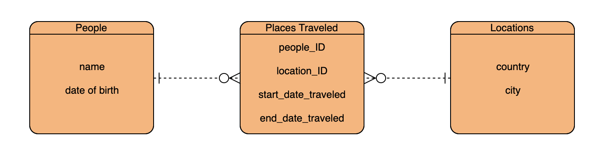

# secondProject

ERD:


## What is it?
This project is an API that I have created around people and they places they have visited.

## Approach taken:
I wanted to use the backend knowledge that I was taught to create an API. I created this API so that I can see where friends of mine have gone and when. With this information, if I choose to visit the same place(s), I'll know who to ask! 

## People
<b> GET /api/people/ </b> 
GET Request will retrieve all records in the people table including their row ID

```
Response:

	{
        "rowid": 1,
        "name": "Bob",
        "date_of_birth": "1/1/01"
    },
    {
        "rowid": 2,
        "name": "Joe",
        "date_of_birth": "2/2/02"
    },
    {
        "rowid": 3,
        "name": "Bill",
        "date_of_birth": null
    }
```
<b> GET /api/people/1/ </b> 
GET Request by ID will retrieve the record that matches that person's row ID
```
Response: 
	{
        "rowid": 1,
        "name": "Bob",
        "date_of_birth": "1/1/01"
    }
 ```
<b> POST /api/people/ </b> 
POST Request will let you create a new record and an ID will also automatically be created via row ID
```
Input: 

	{
        "name": "insert string",
        "date_of_birth": "insert string"
    }
 ```
<b> PUT /api/people/:id/ </b> 
PUT Request will let you update an existing record by its ID
```
Input: 

	{
        "name": "updated string",
        "date_of_birth": "updated string"
    }
 ```
<b> DELETE /api/people/:id/ </b> 
DELETE Request will let you delete an existing record by its ID

## Locations
<b> GET /api/locations/ </b> 
GET Request will retrieve all records in the locations table including their row ID
```
Response: 

	{
		"rowid":  1,
		"country":  "France",
		"city":  "Paris"
	},
	{
		"rowid":  2,
		"country":  "Canada",
		"city":  "Vancouver"
	},
	{
		"rowid":  3,
		"country":  "Madagascar",
		"city":  "Gogogogo"
	},
```
<b> GET /api/locations/:id/ </b> 
GET Request by ID will retrieve the record that matches that location's row ID
```
Response: 

	{
		"rowid":  1,
		"country":  "France",
		"city":  "Paris"
	},
 ```
<b> POST /api/locations/ </b> 
POST Request will let you create a new record and an ID will also automatically be created via row ID
```
Input: 

	{
        "country": "insert string",
        "city": "insert string"
    }
 ```
<b> PUT /api/locations/:id/ </b> 
PUT Request will let you update an existing record by its ID
```
Input: 

	{
        "country": "updated string",
        "city": "updated string"
    }
 ```
<b> DELETE /api/locations/:id/ </b> 
DELETE Request will let you delete an existing record by its ID

## Traveled
<b> GET /api/traveled/ </b> 
GET Request will retrieve all records in the traveled table including their row ID
```
Response: 

	{
		"rowid":  1,
		"name":  "Joe",
		"country":  "France",
		"city":  "Paris",
		"start_date_traveled":  "02/02/01",
		"end_date_traveled":  "06/05/03"
	},
	{
		"rowid":  2,
		"name":  "Bob",
		"country":  "Japan",
		"city":  "Tokyo",
		"start_date_traveled":  "12/02/17",
		"end_date_traveled":  "1/05/18"
	},
	{
		"rowid":  3,
		"name":  "Bill",
		"country":  "Madagascar",
		"city":  "Gogogogo",
		"start_date_traveled":  "01/01/01",
		"end_date_traveled":  "02/02/02"
	}
```
<b> GET /api/traveled/people/:id </b> 
This GET Request will retrieve a person's traveled locations using their ID
```
Response: 

	{
		"rowid":  1,
		"name":  "Joe",
		"country":  "France",
		"city":  "Paris",
		"start_date_traveled":  "02/02/01",
		"end_date_traveled":  "06/05/03"
	}, 
	{
		"rowid":  4,
		"name":  "Joe",
		"country":  "Madagascar",
		"city":  "Gogogogo",
		"start_date_traveled":  "11/03/04",
		"end_date_traveled":  "12/05/04"
	},
 ```
<b> GET /api/traveled/locations/:id </b> 
This GET Request will retrieve a location that people have traveled to using the location ID
```
Response:

	{
		"rowid":  1,
		"name":  "Joe",
		"country":  "France",
		"city":  "Paris",
		"start_date_traveled":  "02/02/01",
		"end_date_traveled":  "06/05/03"
	},
	{
		"rowid":  3,
		"name":  "Bill",
		"country":  "France",
		"city":  "Paris",
		"start_date_traveled":  "09/02/01",
		"end_date_traveled":  "10/03/02"
	}
 ```
<b> POST /api/people/ </b> 
POST Request will let you create a new record that relates a person to a place they visited and an ID will also automatically be created via row ID
```
Input: 

	{
        "people_ID": insert integer,
        "location_ID": insert integer,
        "start_date_traveled": "insert string",
        "end_date_traveled": "insert string"
	}
 ```


--RJ